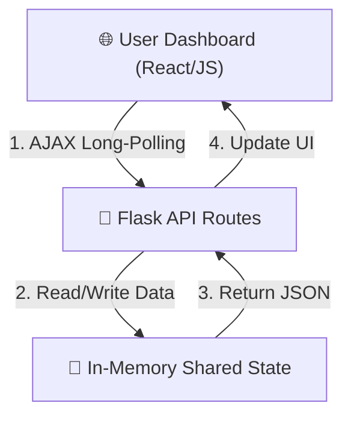
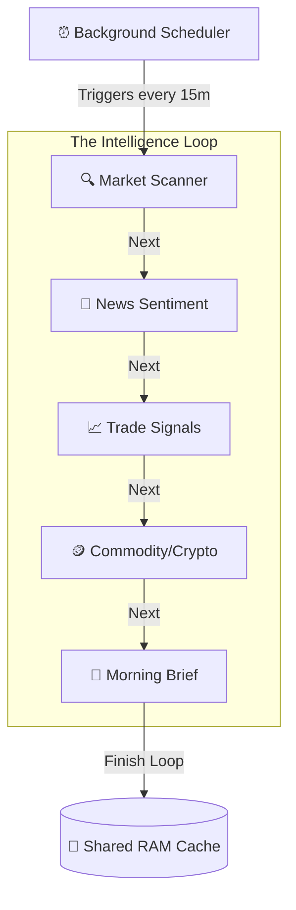
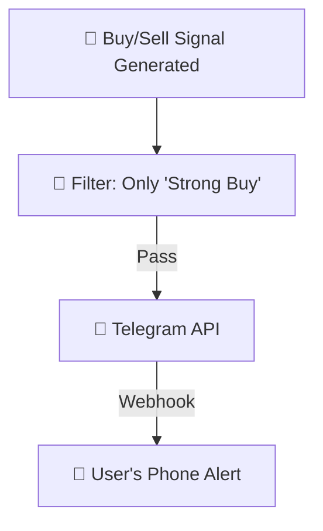

# StockGuru Modular Architecture Guide

Since the full system map is quite complex, I've broken it down into three easy-to-read vertical segments.

## 1. High-Level Communication
How the User interface talks to the Server Brain.

---

## 2. Intelligence Cycle (Agent Layer)
How the 5 agents process market data in the background.

---

## 3. External Alert Flow
How signals reach your phone.

---

## 🚀 Key Advantages
- **Point-to-Point Reliability**: If the News Agent fails, the Price Tracker still works.
- **Why This is Needed**: It ensures you never miss a trade because the system is always "thinking" in the background, even when your laptop is closed.

---

## 🚀 Phase 3: Enhancement Roadmap

The current architecture is built as a **Living Platform**. Here is how we plan to evolve it:

### 🤖 Agent Skill System
Move from passive "running" agents to **active skill triggers**.
- **Example**: A button on a stock record: *"News Agent, explain this 5% drop."*
- **Mechanism**: Backend sends a specific prompt to the News Agent to summarize specific data on demand.

### ⚡ Live WebSockets
Move from "polling" (asking every 5s) to **Live Streaming**.
- **Benefit**: Flicker-free, instant price updates as they happen.
- **Mechanism**: Implementation of `Flask-SocketIO` to push data to the browser immediately.

### 📈 Interactive Paper Trading
Connect the "Paper Trade" buttons to a **Persistent Database**.
- **Benefit**: Track your virtual Profit & Loss (P&L) over days and weeks.
- **Mechanism**: A local SQLite database to store your "Buy" and "Sell" executions and calculate realized gains.
