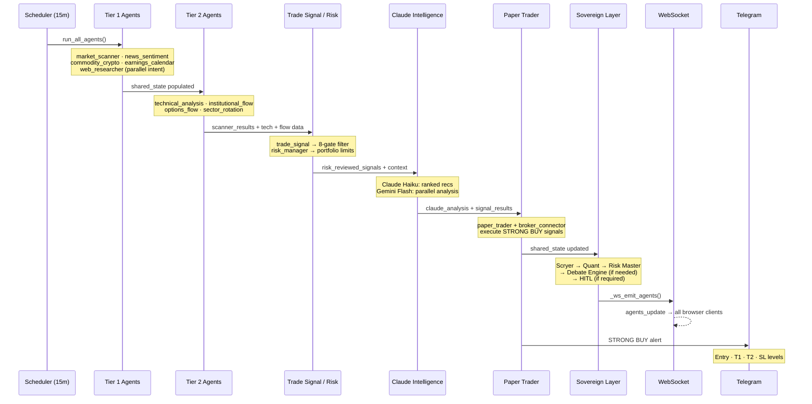

# StockGuru — Full System Map
**v2.0 · M2 Complete · 14 Agents + Sovereign Layer**

Open `StockGuru_Architecture_Visual.html` in a browser for the interactive version (click nodes for details + optimisation tips).

---

## Complete Data Flow (Input → Output)

```mermaid
flowchart TD
    subgraph EXT["🌐 External Data Sources"]
        YF["Yahoo Finance\n(prices every 5m)"]
        NSE["NSE API\n(option chain, deals)"]
        SCR["Screener.in\n(fundamentals)"]
        NEWS["News / RSS\n(headlines)"]
        TGI["Telegram\n(HITL in)"]
    end

    subgraph CACHE["💾 Price Cache"]
        PC["price_cache\n(in-memory dict)"]
    end

    subgraph T1["🟣 Tier 1 — Market Data Agents (parallel)"]
        MS["Market Scanner\n8-gate screener"]
        NS["News Sentiment\nNLP scoring"]
        CC["Commodity & Crypto\nGold·Oil·BTC"]
        EC["Earnings Calendar\nevent risk"]
        WR["Web Researcher\nGemini deep-dive"]
    end

    subgraph T2["🔵 Tier 2 — Technical & Flow Agents"]
        TA["Technical Analysis\nRSI·MACD·EMA·BB"]
        IF["Institutional Flow\nFII·DII net"]
        OF["Options Flow\nPCR·OI·VIX"]
        SR["Sector Rotation\nmomentum ranking"]
    end

    subgraph T3["🟡 Tier 3 — Signal Generation"]
        TS["Trade Signal\n8-gate conviction filter"]
        RM["Risk Manager\nportfolio-level limits"]
    end

    SS[("🔵 SHARED STATE\nCentral Memory Bus\n~40 keys")]

    subgraph T4["🩷 Tier 4 — AI Intelligence"]
        CI["Claude Intelligence\nClaude Haiku 3.5"]
        PM["Pattern Memory\nself-learning patterns"]
    end

    subgraph T5["🟠 Tier 5 — Execution Output"]
        PT["Paper Trader\nNSE simulation"]
        MB["Morning Brief\n08:00 daily"]
    end

    subgraph BROKER["🟡 Broker Layer"]
        BC["broker_connector.py\nPaperBroker · NSE order types"]
    end

    subgraph SOV["👑 Sovereign Layer (post-cycle)"]
        SY["The Scryer\nsource confidence"]
        QT["The Quant\nconviction tiers"]
        RMAS["Risk Master\nVETO engine"]
        DE["Debate Engine\nBull vs Bear (LLM)"]
        HITL["HITL Controller\nTelegram approval"]
        POB["Post Mortem\nLLM reflexion"]
        OBS["Observer\nNSE scan every 4h"]
        SBT["Synthetic Backtester\nstress test every 6h"]
    end

    subgraph LEARN["🟢 Learning Layer"]
        ST["Signal Tracker\noutcome recording"]
        WA["Weight Adjuster\nadaptive scoring"]
        BKT["BacktestEngine\nhistorical validation"]
    end

    subgraph OUT["🟢 Outputs"]
        DASH["Dashboard\nFlask-SocketIO WebSocket"]
        TGO["Telegram Alerts\npush notifications"]
        DB["Data Store\nJSON · SQLite"]
    end

    YF --> PC
    NSE --> PC
    NSE --> OBS
    SCR --> OBS
    NEWS --> NS
    NEWS --> WR
    TGI --> HITL

    PC --> MS & NS & CC & TA & ST
    MS --> SS
    NS --> SS
    CC --> SS
    EC --> SS
    WR --> SS

    TA --> SS
    IF --> SS
    OF --> SS
    SR --> SS

    SS --> TS --> RM --> SS
    SS --> CI & PM
    PM --> CI --> SS

    SS --> PT --> BC --> SS
    SS --> MB

    SS --> SY --> QT --> RMAS --> DE
    RMAS --> HITL --> PT
    DE --> SS
    POB --> DB
    OBS --> SS
    SBT --> SS

    PT --> ST --> DB --> PM
    DB --> WA --> SS
    DB --> BKT

    SS -- "WebSocket push" --> DASH
    PT --> TGO
    MB --> TGO
    PT --> DB

    style SS fill:#003b44,stroke:#00C4CC,stroke-width:3px,color:#00C4CC
    style BC fill:#3b2a00,stroke:#fbbf24,stroke-width:2px
    style CI fill:#3b0030,stroke:#f472b6,stroke-width:2px
    style DASH fill:#003b10,stroke:#4ade80,stroke-width:2px
```



---

## Agent Execution Order (Per 15-min Cycle)



---

## Optimization Opportunity Map

### 🔴 High Priority (M3)
| Component | Issue | Fix |
|---|---|---|
| `morning_brief.py` | Telegram exceptions propagate (xfail) | Wrap `send_telegram_fn` in try/except |
| `shared_state` | Lost on server restart — agents rebuild cold | Add Redis backend or 5-min JSON snapshot |
| `paper_trader.py` | No trailing SL — misses T1→breakeven move | Implement trailing SL in `broker_connector.tick()` |
| Gunicorn + SocketIO | `app.run()` vs `socketio.run()` in production | Use `gunicorn -k geventwebsocket.gunicorn.workers.GeventWebSocketWorker` |

### 🟡 Medium Priority (M3/M4)
| Component | Enhancement | Value |
|---|---|---|
| `trade_signal.py` | Equal-weighted gates → use `learned_weights.json` | Higher win rate |
| `claude_intelligence.py` | Add `post_mortem` insights to context | Self-improving AI |
| `news_sentiment.py` | Keyword scoring → Gemini Flash semantic scoring | 10× accuracy |
| `weight_adjuster.py` | Only adjusts final score → also adjust gate weights | More adaptive |
| `backtesting/engine.py` | Fixed scenarios → walk-forward optimisation | Optimal parameters |
| Dashboard | Static watchlist → add/remove via UI | User control |

### 🟢 Low Priority (M4)
| Component | Enhancement | Notes |
|---|---|---|
| `price_cache` | Add Redis → price history survives restart | Enables intraday charting |
| `broker_connector.py` | Implement `LiveBrokerAdapter` for Zerodha Kite | Live trading readiness |
| Telegram bot | Add `/portfolio`, `/scan SYMBOL` commands | Mobile-first access |
| `signal_tracker.py` | Async outcome checking | Avoid blocking price fetch |
| `synthetic_backtester.py` | Monte Carlo → replaces fixed 3-scenario | Statistical confidence |

---

## Key Data Keys in Shared State

| Key | Written by | Read by |
|---|---|---|
| `scanner_results` | market_scanner | trade_signal, claude_intelligence, morning_brief |
| `trade_signals` | trade_signal | risk_manager |
| `actionable_signals` | trade_signal | risk_manager, paper_trader |
| `risk_reviewed_signals` | risk_manager | claude_intelligence, paper_trader |
| `claude_analysis` | claude_intelligence | paper_trader, dashboard |
| `signal_results` | claude_intelligence | morning_brief, dashboard |
| `paper_portfolio` | paper_trader | morning_brief, dashboard, risk_manager |
| `pattern_library` | pattern_memory | claude_intelligence |
| `institutional_flow` | institutional_flow | trade_signal, claude_intelligence |
| `options_data` / `pcr` | options_flow | trade_signal, claude_intelligence |
| `technical_data` | technical_analysis | trade_signal |
| `sector_momentum` | sector_rotation | trade_signal, claude_intelligence |
| `scryer_output` | scryer | quant |
| `quant_output` | quant | risk_master |
| `risk_master_output` | risk_master | debate_engine, hitl |
| `debate_results` | debate_engine | dashboard |
| `observer_output` | observer | dashboard, sovereign |
| `synthetic_backtest` | synthetic_backtester | dashboard |
| `broker_order_book` | paper_trader (broker) | dashboard |
| `_price_cache` | fetch_all_prices | all agents (read-only) |

---

## File Structure Summary

```
stockguru/
├── app.py                          # Flask + SocketIO server (1,430 lines)
├── requirements.txt                # Dependencies
├── static/
│   └── index.html                  # Dashboard SPA (5,415 lines)
├── stockguru_agents/
│   ├── agents/                     # 15 core agents
│   │   ├── market_scanner.py
│   │   ├── news_sentiment.py
│   │   ├── commodity_crypto.py
│   │   ├── earnings_calendar.py
│   │   ├── web_researcher.py
│   │   ├── technical_analysis.py
│   │   ├── institutional_flow.py
│   │   ├── options_flow.py
│   │   ├── sector_rotation.py
│   │   ├── trade_signal.py
│   │   ├── risk_manager.py
│   │   ├── claude_intelligence.py
│   │   ├── pattern_memory.py
│   │   ├── paper_trader.py
│   │   └── morning_brief.py
│   ├── sovereign/                  # Sovereign meta-layer
│   │   ├── scryer.py
│   │   ├── quant.py
│   │   ├── risk_master.py
│   │   ├── debate_engine.py
│   │   ├── hitl_controller.py
│   │   ├── post_mortem.py
│   │   ├── memory_engine.py        # SQLite
│   │   ├── observer.py
│   │   ├── synthetic_backtester.py
│   │   └── builder_agent.py
│   ├── backtesting/
│   │   └── engine.py               # BacktestEngine
│   ├── learning/
│   │   ├── signal_tracker.py
│   │   └── weight_adjuster.py
│   ├── broker_connector.py         # NSE PaperBroker (M1)
│   └── channels/                   # Future live broker adapters
├── data/                           # Runtime JSON + SQLite
├── logs/                           # Rotating log files
├── reports/                        # Architecture docs
└── tests/                          # 66 tests passing
    ├── conftest.py
    ├── test_agents_unit.py         # 51 tests
    ├── test_integration.py         # 4 tests
    └── test_m2_websocket.py        # 16 tests
```
